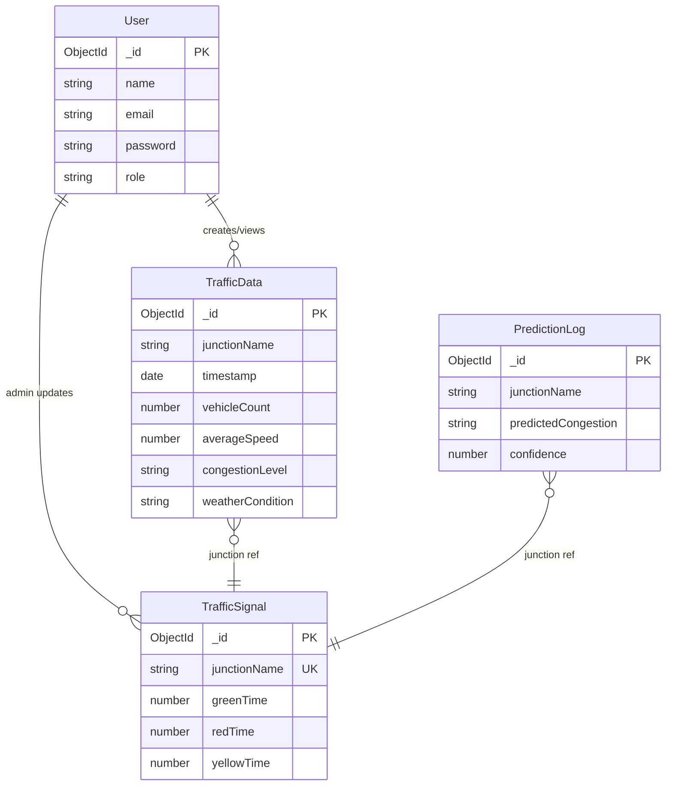

# Entity-Relationship Diagram

## Entities

### User
| Field | Type | Description |
|-------|------|-------------|
| _id | ObjectId | Primary key |
| name | String | User name |
| email | String | Unique, login |
| password | String | Hashed |
| role | String | user \| admin |
| createdAt | Date | |

### TrafficData
| Field | Type | Description |
|-------|------|-------------|
| _id | ObjectId | Primary key |
| junctionName | String | AIIMS, ITO, etc. |
| timestamp | Date | |
| vehicleCount | Number | |
| averageSpeed | Number | km/h |
| congestionLevel | String | Low \| Medium \| High |
| weatherCondition | String | Clear, Rain, etc. |
| latitude | Number | |
| longitude | Number | |

### TrafficSignal
| Field | Type | Description |
|-------|------|-------------|
| _id | ObjectId | Primary key |
| junctionName | String | Unique |
| greenTime | Number | seconds |
| redTime | Number | seconds |
| yellowTime | Number | seconds |
| lastUpdated | Date | |
| updatedBy | String | system \| manual \| ai_optimization |

### PredictionLog
| Field | Type | Description |
|-------|------|-------------|
| _id | ObjectId | Primary key |
| junctionName | String | |
| timestamp | Date | |
| inputFeatures | Object | vehicleCount, averageSpeed, weather |
| predictedCongestion | String | Low \| Medium \| High |
| confidence | Number | 0-1 |
| modelVersion | String | |

## Relationships

```
User (1) ────── auth ──────► (*) TrafficData (read/write)
User (1) ────── auth ──────► (*) TrafficSignal (admin: write)
TrafficData (*) ─ junction ─► (1) TrafficSignal [logical]
PredictionLog (*) ─ junction ─► (1) TrafficSignal [logical]
```

## Mermaid ER Diagram


